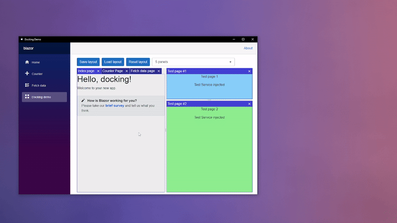

#  Photino.Blazor.Docking

## About
Cross-platform docking system for Photino.Blazor applications with split, tabs and floating panels support.\
Implements panel arrangement with a horizontal/vertical splitter, grouping into a tabbed panel and detaching panels into a separate floating windows.
Supports hiding/showing panels by its identificators and saving/loading docking layout in JSON format.

## How to use
1. Include **Photino.Blazor.Docking** as PackageReference to your project.
2. Include css and js files from _content/Radzen.Blazor, _content/Photino.Blazor.CustomWindow and _content/Photino.Blazor.Docking to your index.html as shown in the [example](Photino.Blazor.Docking.Sample/wwwroot/index.html).\
   Or you can add their contents manually as your own files.
3. Configure and add DockingService to your Photino.Blazor application service collection with `AddPhotinoBlazorDocking()` extension.\
   You must declare services initialization function and dock panels configuration set (refer to the extension summary and [example](Photino.Blazor.Docking.Sample/Program.cs)).
4. Use `DockPanelHost` component as docking host component. Next, there are two options for the panels initial placement:
   - Load docking layout from JSON via DockingService's `LoadLayout()` method before the DockPanelHost component is initialized.
   - Define DockPanelHost's `DefaultLayout` RenderFragment (refer to the [example](Photino.Blazor.Docking.Sample/Pages/DockingDemoPage.razor)).
     > You can paste here DockPanelSplit, DockPanelTabs or DockPanel component.\
     DockPanelSplit should contain two components of the types listed above.\
     DockPanelTabs can contain only DockPanel components.\
     DockPanel must be used strictly with the identificator or blazor component, specified in the configuration.
5. In order to keep the current state of your component when attaching/detaching dock panel, it is necessary to implement a mechanism for store/restore state data. There are two ways that you can use together:
   - Storing data in your own services and restoring it from there on component initializing.
   - Using `IContextDockPanel` interface. Implement it for your component using the `PanelContext` property for any object as state context (for example, a model instance, scroll positions, etc.).\
     [Implementation example](Photino.Blazor.Docking.Sample/Pages/Counter.razor).

## Next steps
- Inserting float dock panel between specific tabs on dragging.
- Dynamic page adding (documents host panel).
- Get away from Radzen dependencies (own splitter implementation).
